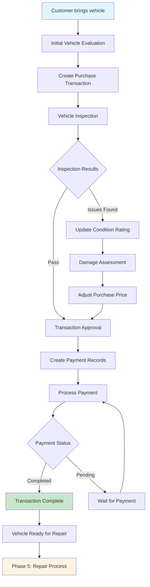
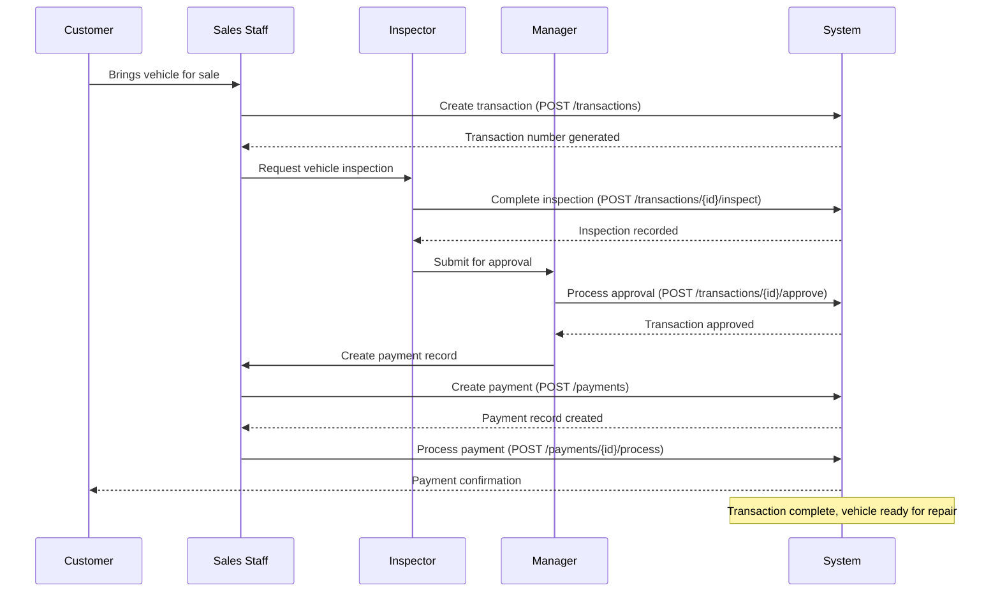
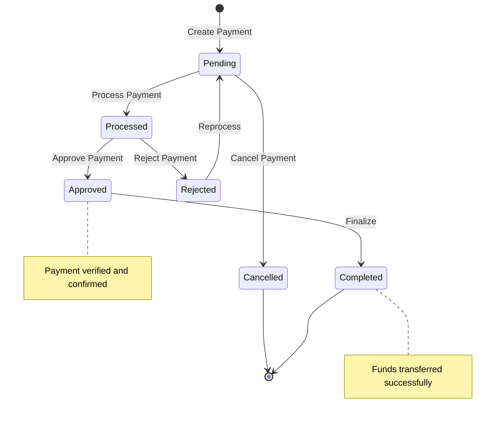
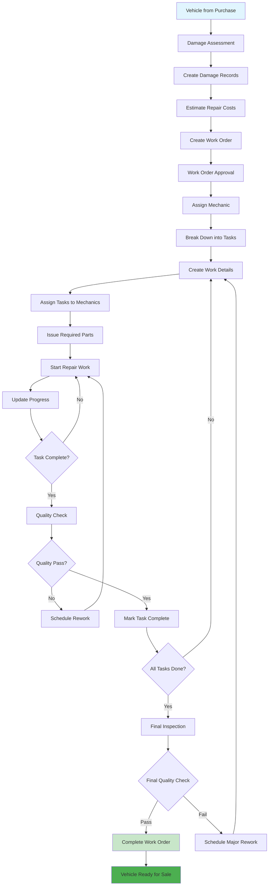
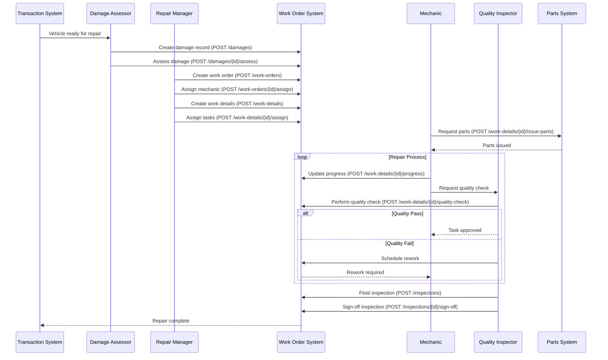
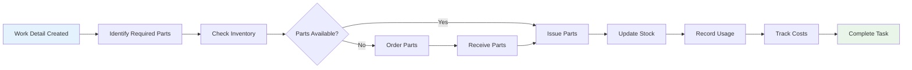
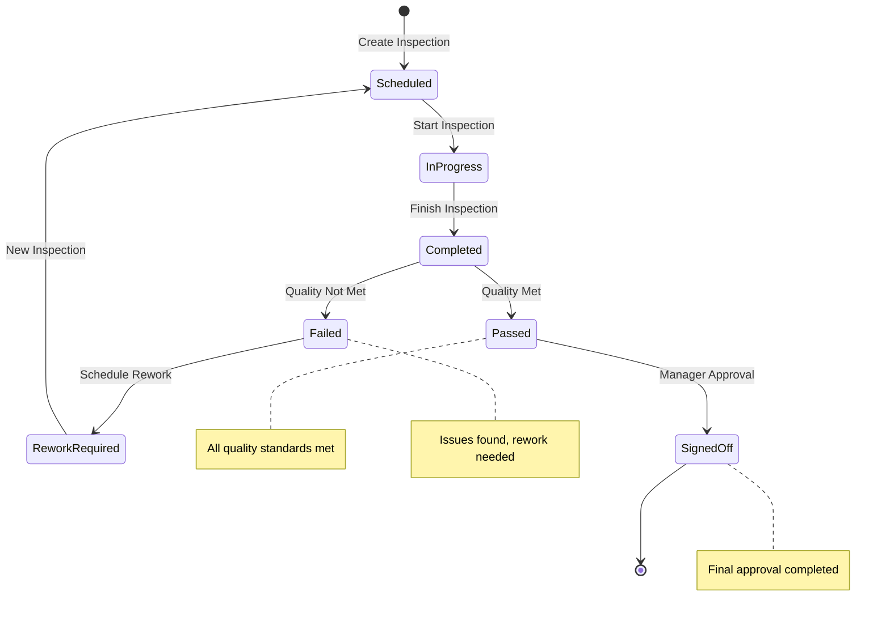
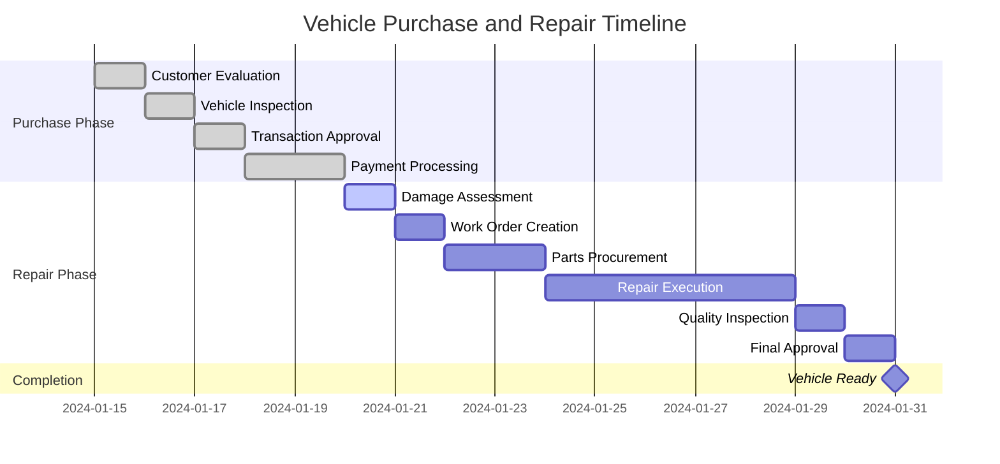
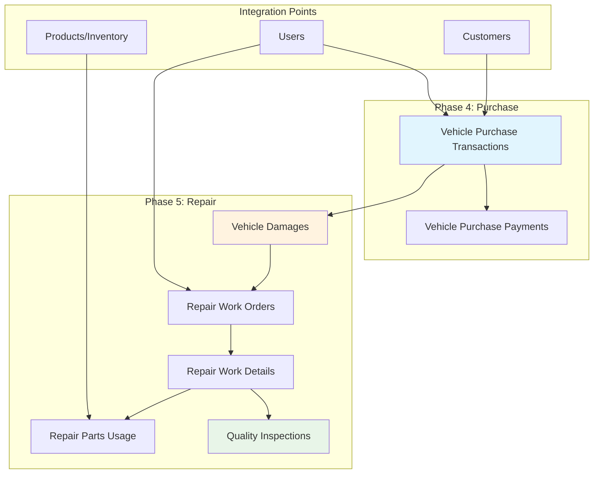

# Business Flow Diagrams - Phase 4 & 5: Vehicle Purchase and Repair Management

## Overview

This document provides comprehensive business flow diagrams for the Point of Sale Showroom system, specifically covering Phase 4 (Vehicle Purchase Flow) and Phase 5 (Repair Management System).

## Table of Contents

1. [Phase 4: Vehicle Purchase Flow](#phase-4-vehicle-purchase-flow)
2. [Phase 5: Repair Management Flow](#phase-5-repair-management-flow)
3. [Integrated End-to-End Process](#integrated-end-to-end-process)
4. [API Endpoint Mapping](#api-endpoint-mapping)

---

## Phase 4: Vehicle Purchase Flow

### High-Level Vehicle Purchase Process



### Detailed Transaction Management Flow



### Payment Processing Flow



---

## Phase 5: Repair Management Flow

### Complete Repair Management Process



### Detailed Repair Workflow



### Parts Management Flow



### Quality Inspection Workflow



---

## Integrated End-to-End Process

### Complete Vehicle Lifecycle Flow



### Data Flow Architecture



---

## API Endpoint Mapping

### Phase 4: Vehicle Purchase API Flow

```mermaid
graph LR
    subgraph "Transaction Management"
        A[POST /transactions] --> B[GET /transactions/{id}]
        B --> C[POST /transactions/{id}/inspect]
        C --> D[POST /transactions/{id}/approve]
    end
    
    subgraph "Payment Processing"
        E[POST /payments] --> F[POST /payments/{id}/process]
        F --> G[POST /payments/{id}/approve]
    end
    
    subgraph "Monitoring"
        H[GET /transactions/pending-inspection]
        I[GET /transactions/pending-approval]
        J[GET /payments/overdue]
        K[GET /dashboard]
    end
    
    D --> E
    G --> K
```

### Phase 5: Repair Management API Flow

```mermaid
graph TD
    subgraph "Damage Management"
        A[POST /damages] --> B[POST /damages/{id}/assess]
    end
    
    subgraph "Work Order Flow"
        C[POST /work-orders] --> D[POST /work-orders/{id}/assign]
        D --> E[POST /work-orders/{id}/approve]
    end
    
    subgraph "Task Execution"
        F[POST /work-details] --> G[POST /work-details/{id}/assign]
        G --> H[POST /work-details/{id}/progress]
        H --> I[POST /work-details/{id}/quality-check]
    end
    
    subgraph "Parts & Quality"
        J[POST /work-details/{id}/issue-parts]
        K[POST /inspections] --> L[POST /inspections/{id}/sign-off]
    end
    
    B --> C
    E --> F
    F --> J
    I --> K
```

---

## Business Rules Summary

### Phase 4 Rules
1. **VIN Uniqueness**: Each VIN can only exist once in the system
2. **Sequential Approval**: Inspection must be completed before approval
3. **Payment Validation**: Payments cannot exceed agreed vehicle value
4. **Status Progression**: Transactions follow: Pending → Inspection → Approved → Completed

### Phase 5 Rules
1. **Damage-First**: Work orders can only be created after damage assessment
2. **Parts Availability**: Tasks cannot start without required parts
3. **Quality Gates**: Each task must pass quality check before completion
4. **Progressive Completion**: Work details must be completed before work order completion
5. **Final Inspection**: All work orders require final quality inspection

### Integration Rules
1. **User Roles**: Different endpoints require different user roles (admin, sales, mechanic, inspector)
2. **Transaction Linkage**: Repair records must link to valid purchase transactions
3. **Audit Trail**: All critical operations are logged with user and timestamp
4. **Cost Tracking**: All costs are tracked and aggregated for profitability analysis

---

This comprehensive flow documentation provides clear guidance for implementation, testing, and operational understanding of the complete vehicle purchase and repair management system.